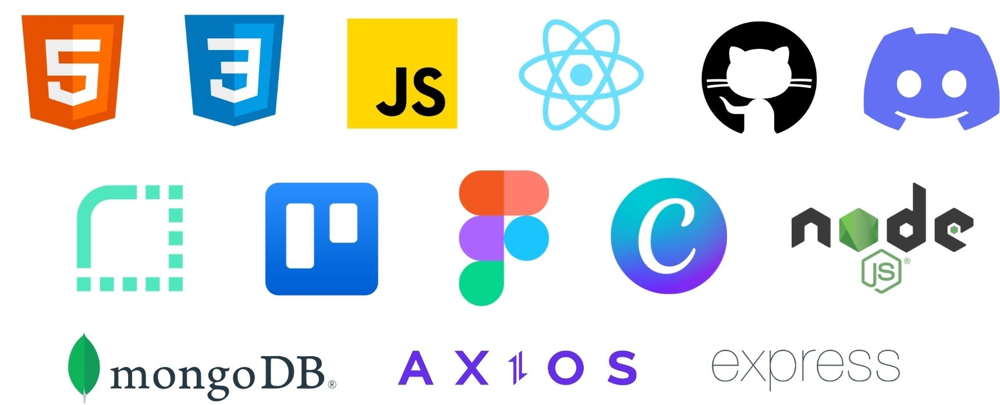

**Silentmoon - Yoga & Meditation App**

<div style="display: flex; justify-content: center;">
  
</div>
Welcome to the Silentmoon Full Stack MERN (MongoDB, Express, React, Node.js) App repository! Silentmoon is a platform dedicated to providing users with a tranquil and enriching yoga and meditation experience. Users can register, explore a variety of yoga videos and playlists, create and manage their own playlists, and immerse themselves in soothing meditation music sourced from the Spotify API. This README file will guide you through the installation, features, and technologies used in the app.

## Table of Contents 📑

- [Demo](#demo)
- [Features](#features)
- [Tech Stack](#tech-stack)
- [Getting Started](#getting-started)
- [Installation](#installation)
- [Usage](#usage)
- [API Integration](#api-integration)
- [Database](#database)
- [Authentication](#authentication)
- [Backend Routes](#backend-routes)
- [Design](#design)
- [Deployment](#deployment)
- [Third-Party Libraries & Tools](#third-party-libraries--tools)
- [Contributors](#contributors)

## Demo

You can view a live demo of the Silentmoon app at https://silentmoon.alpaycelik.dev.

## Features

The Silentmoon app has the following features:

- **User Registration**: Users can create accounts to personalize their experience.
- **Video & Playlist Exploration**: Users can browse a collection of yoga videos and playlists.
- **Playlist Management**: Registered users can create, edit, and delete their own playlists.
- **Spotify Integration**: The app features meditation music from the Spotify API.
- **Mobile-based**: The app is accessible on mobile with minimal loss of functionality.
- **Reminder**: Users can set a reminder for their next yoga session.
- **High Quality Videos**: The videos are hosted on Cloudinary and are of high quality.
- **Filter**: Users can filter the videos by mood and several categories.
- **Search**: Users can search for videos and playlists by title.
- **Favorites**: Users can add videos to their favorites.

<div style="display: flex; justify-content: center;">
  
</div>

## Tech Stack

The Silentmoon app uses the following technologies:

- **Frontend**: React, HTML, CSS
- **Backend**: Node.js, Express
- **Database**: MongoDB
- **API Integration**: Spotify API
- **Design Tools**: Canva, Figma
- **Version Control**: Git
- **Deployment**: Render.com
- **Communication**: Discord
- **HTTP Client**: Axios
- **Project Management**: Trello

<div style="display: flex; justify-content: center;">
  
</div>

## Getting Started

To run Silentmoon on your local machine, follow these steps:

## Installation

1. Clone this repository:

   ```bash
   git clone https://github.com/AlpayC/Fullstack_Abschlussprojekt_SilentMoon.git
   ```

2. Navigate to the project directory:

   ```bash
   cd silentmoon
   ```

3. Install frontend and backend dependencies:

   ```bash
   npm install
   cd frontend
   npm install
   cd ../backend
   npm install
   ```

## Usage

1. Start the app:

   ```bash
   npm run dev
   ```

   The frontend server will run on http://localhost:3000 and the backend server will run on http://localhost:3001.

2. Open the app in your browser at http://localhost:3000.

3. Register a new account or log in with the following credentials:

   ```bash
   email:
    password:
   ```

4. Explore the app!

5. To stop the server, press `Ctrl + C`.

## API Integration

The Silentmoon app integrates with the Spotify API to provide meditation music. To set up Spotify integration:

1. Create a Spotify Developer account and create a new app to get your API credentials.

2. In the `root` directory, create a `.env` file and add your Spotify API credentials:

   ```
   SPOTIFY_ID=your_client_id
   SPOTIFY_=your_client_secret
   ```

3. Add the following credentials `.env` file for the JWT token with `require("crypto").randomBytes(64).toString("hex")`:

   ```
   TOKEN_SECRET= your_token_secret
   ```

4. Add the following credentials `.env` file for the MongoDB connection:

   ```
   DB=your_mongodb_connection string (e.g. mongodb://localhost:27017/silentmoon)
   PORT=3000
   ```

5. Later add the following credentials `.env` file for the Render connection within the Node server:

   ```
   VITE_BACKEND_URL
   RENDER_EXTERNAL_URL
   ```

## Database

The Silentmoon app uses MongoDB to store user data. The database is hosted on MongoDB Atlas. The app uses the `mongoose` library to connect to the database. The app uses the `dotenv` library to load environment variables from the `.env` file. The app uses the `nodemon` library to automatically restart the server when changes are made to the code. The app uses the `morgan` library to log HTTP requests. The Videos are stored on `cloudinary`.

## Authentication

The Silentmoon app uses JWT authentication. The app generates a JWT token when a user registers or logs in. The token is stored in local storage and is used to authenticate the user for protected routes. The token is valid for 24 hours. The app uses the `jsonwebtoken` library to generate and verify tokens. The app uses the `bcrypt` library to hash passwords. The app uses the `axios` library to make HTTP requests.

## Backend Routes

The Silentmoon app uses the following routes:

**USER**

- `/api/user` - User routes
- `/api/user/secure` - Authentication routes
- `/api/user/getUserData` - Fetch User data routes
- `/api/user/signup` - Signup routes
- `/api/user/login` - Login routes
- `/api/user/logout` - Logout routes
- `/api/user/addexercise` - Add exercise routes
- `/api/user/deleteexercise` - Delete exercise routes
- `/api/user/addplaylist` - Add playlist routes
- `/api/user/deleteplaylist` - Delete playlist routes
- `/api/user/updatereminder` - Update reminder routes

**MUSIC**

- `/api/spotify` - Spotify routes
- `/api/spotify/playlist` - All Playlist routes
- `/api/spotify/playlist/:id` - Playlist by id routes
- `/api/spotify/onetrack/` - One Track by Id routes
- `/api/spotify/getPlaylistDetails` - Playlist Details routes

**VIDEOS**

- `/api/exercises` - Video routes
- `/api/exercises/details:id` - Video by id routes
- `/api/exercises/filter` - Filter routes by query

## Design

The app's UI/UX was designed and Figma The app's wireframes were designed using Figma

## Deployment

The app is deployed using Render.com. Continuous deployment is set up to automatically deploy the app when changes are pushed to the `main` branch. The app is deployed at https://silentmoon-grpw.onrender.com/. On Render the app uses the following environment variables: `SPOTIFY_ID`, `SPOTIFY_SECRET`, `TOKEN_SECRET`, `DB`, `PORT`, `VITE_BACKEND_URL`, `RENDER_EXTERNAL_URL`.

## Third-Party Libraries & Tools

The Silentmoon app uses the following third-party libraries:

- `axios` - Promise based HTTP client for the browser and node.js
- `bcrypt` - A library to help you hash passwords
- `cors` - CORS is a node.js package for providing a Connect/Express middleware that can be used to enable CORS with various options.
- `dotenv` - Dotenv is a zero-dependency module that loads environment variables from a .env file into process.env.
- `express` - Fast, unopinionated, minimalist web framework for node.
- `jsonwebtoken` - An implementation of JSON Web Tokens.
- `mongoose` - Mongoose is a MongoDB object modeling tool designed to work in an asynchronous environment.
- `morgan` - HTTP request logger middleware for node.js
- `nodemon` - Nodemon is a utility that will monitor for any changes in your source and automatically restart your server.
- `react-router-dom` - DOM bindings for React Router.
- `cloudinary` - Cloudinary is a cloud service that offers a solution to a web application's entire image management pipeline.

## Contributors

Special thanks to the following contributors for their hard work on this project:

- [Elisaatnam](https://github.com/Elisaatnam) - Frontend Developer & Ui/Ux Designer
- [Lis-art](https://github.com/Lis-art) - Trellomaster & Frontend Developer
- [mirzakomic](https://github.com/mirzakomic) - CSS Master & Frontend Developer
- [AlpayC](https://github.com/AlpayC) - Backend Developer & Git Master

Feel free to reach out with any questions or feedback. Happy coding and meditating with Silentmoon! 🧘‍♀️🌙
